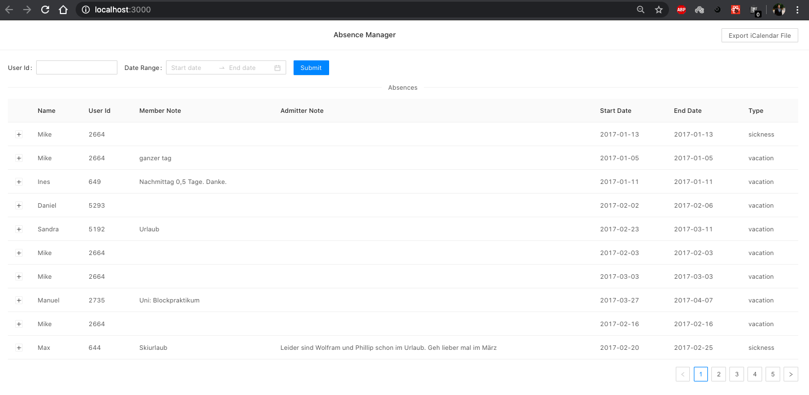

This project was bootstrapped with [Create React App](https://github.com/facebook/create-react-app). Uses React version 16.13.1.

## Dependencies
React - 16.13.1
Antd (for UI) - 4.2.0

## Available Scripts

In the project directory, you can run:

### `npm start`

Runs the app in the development mode. 
Open [http://localhost:3000](http://localhost:3000) to view it in the browser.

The page will reload if you make edits. 
You will also see any lint errors in the console.

### `npm test`

Launches the test runner in the interactive watch mode. 
See the section about [running tests](https://facebook.github.io/create-react-app/docs/running-tests) for more information.

## Final UI

## Explanation of UI components

1. User id can be entered manually. Date Range can be selected separately or can be clubbed with user id.
2. When clicked up on (+) symbol in each row, a message is shown as expected in the problem statement - "#{member.name} is on vacation" or "#{member.name} is sick".
3. When clicked on `Export iCalender File` button on the corner a file named `calendar.ics` will be downloaded.